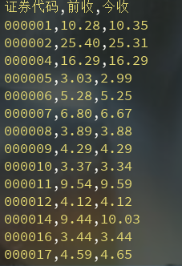

# StockPriceSpider
深圳证券交易所历史数据采集

##### 用户只需配置如下数据即可：

###### start = '2019-01-23'  开始日期
###### end = '2019-01-23'    结束日期
###### csvfile = 'mycsv.csv' 存储csv文件名

##### 下载网页excel附件：

##### 解析出excel附件指定列数据，写入csv文件：

